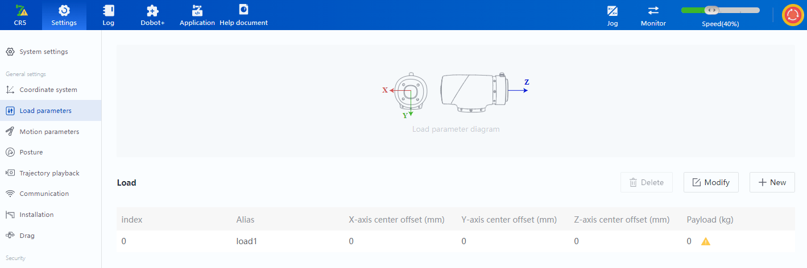

# Dobot Magician E6 - Control por TCP y Voz

Proyecto para controlar un Dobot Magician E6 por Ethernet desde PC, con dos modos principales:

- Envio manual de comandos TCP.
- Deteccion de voz de palabras clave y envio automatico al robot.



## Tabla De Contenidos

- [Resumen](#resumen)
- [Estructura Del Proyecto](#estructura-del-proyecto)
- [Instalacion Del Entorno](#instalacion-del-entorno)
- [Flujo Rapido De Uso](#flujo-rapido-de-uso)
- [Ejecutables](#ejecutables)
- [Documentacion Navegable](#documentacion-navegable)
- [Seguridad Operativa](#seguridad-operativa)

## Resumen

Implementa una arquitectura simple y reproducible para integrar:

- Robot-side en Lua (DobotStudio Pro 4.4).
- PC-side en Python (GUI, TCP, voz offline).
- Comandos operativos: derecha, izquierda, arriba, abajo, home/origen, activar_ventosa, desactivar_ventosa.

## Estructura Del Proyecto

- dobot_scripts/
  - 01_test/: pruebas de movilidad, homing y seguridad.
  - 02_com/tcp_cmd.lua: servidor TCP en robot.
- pc_scripts/
  - 02_com/send_cmd/send_cmd.py: cliente TCP manual (GUI y CLI).
  - 03_ml/voice_word_gui.py: deteccion de voz local.
  - 04_voice_cmd/voice_cmd.py: voz + envio TCP integrado.
- engitbook/
  - referencia API local de Dobot (solo lectura).
- project_docs/
  - documentacion funcional y teorica del proyecto.

## Instalacion Del Entorno

Instalar dependencias desde:

- [requirements.txt](requirements.txt)

Comando sugerido:

```bash
python -m pip install -r project_docs/requirements.txt
```

## Flujo Rapido De Uso

1. En el robot, ejecutar dobot_scripts/02_com/tcp_cmd.lua.
2. En el PC, abrir una app:
   - Manual TCP: pc_scripts/02_com/send_cmd/send_cmd.py
   - Voz local: pc_scripts/03_ml/voice_word_gui.py
   - Voz + TCP: pc_scripts/04_voice_cmd/voice_cmd.py
3. Verificar conectividad con ping.
4. Operar comandos por boton o por voz.

## Ejecutables

- pc_scripts/03_ml/dist/voice_word_gui.exe
- pc_scripts/04_voice_cmd/dist/voice_cmd.exe

## Documentacion Navegable

Indice general:

- [INDEX.md](../INDEX.md)

Grupos:

- [Grupo 01 - Pruebas Robot](grupos/01_grupo_test.md)
- [Grupo 02 - Comunicacion TCP](grupos/02_grupo_com_tcp.md)
- [Grupo 03 - Voz Local](grupos/03_grupo_voz_local.md)
- [Grupo 04 - Voz + TCP](grupos/04_grupo_voz_tcp.md)

Teoria:

- [Modelo De Deteccion De Voz](teoria/teoria_modelo_deteccion_voz.md)
- [Brazo Robotico, Joints Y Movimientos](teoria/teoria_brazo_joints_movimientos.md)
- [TCP Y Arquitectura](teoria/teoria_tcp_y_arquitectura.md)
- [Seguridad Operativa](teoria/teoria_seguridad_operacion.md)

Multimedia:

- [Video De Prueba](media/video_proof.mp4)

## Seguridad Operativa

- Mantener E-stop accesible durante pruebas.
- Iniciar con velocidades bajas y workspace despejado.
- Validar deteccion de voz en local antes del envio automatico.
