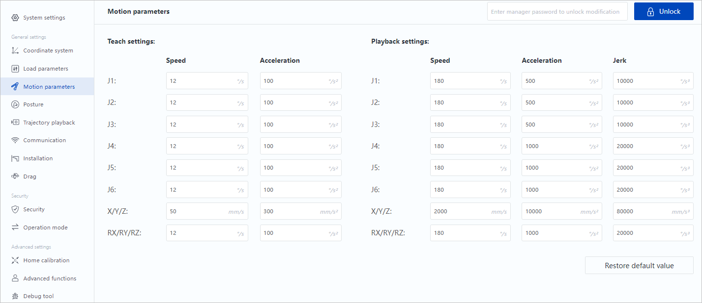

# Teoria - TCP y arquitectura de integracion PC-Robot

## Arquitectura logica del sistema

- Robot (Lua): servidor TCP en el controlador (`tcp_cmd.lua`).
- PC (Python): cliente TCP persistente (`RobotConnection`).
- Capa de interfaz: GUI manual (02_com) y GUI por voz (04_voice_cmd).

Modelo de intercambio:

- Request/response textual por linea.
- Comandos discretos de baja longitud y semantica explicita.

## Por que TCP para este caso

TCP aporta:

- Entrega confiable y ordenada de bytes.
- Control de errores y retransmision.
- Semantica de flujo adecuada para protocolos de linea.

Para control de robot en LAN local, esta confiabilidad suele ser preferible frente a UDP cuando el throughput no es critico.

## Conexion persistente

Mantener una sesion TCP activa evita handshakes repetidos y reduce latencia percibida por comando. Tambien disminuye puntos de falla de reconexion en operaciones continuas.

## Contrato de protocolo de aplicacion

- Codificacion UTF-8.
- Delimitador de mensaje: salto de linea (`\n`).
- Unidad logica: 1 comando por linea, 1 respuesta por linea.
- Comandos idempotentes o acotados para minimizar estados ambiguos.

## Resiliencia y manejo de errores

Estrategias implementadas:

- Timeout configurable de socket.
- Deteccion de desconexion y reconexion en siguiente envio.
- Respuestas textuales de error para diagnostico rapido.

Buenas practicas recomendadas:

- Log de comandos/respuestas con timestamp.
- Validacion de comandos permitidos antes de enviar al robot.
- Separacion de hilo de red y hilo de UI para evitar bloqueos de interfaz.

## Escalabilidad funcional

La arquitectura permite extender comando a comando sin romper compatibilidad:

- Agregar nuevo comando en Lua (`exec_cmd`).
- Exponerlo en GUI Python.
- Mantener el mismo contrato de linea.

## Referencias cruzadas internas

- Modelo de reconocimiento de voz: [teoria_modelo_deteccion_voz.md](teoria_modelo_deteccion_voz.md)
- Cinematica y movimiento del robot: [teoria_brazo_joints_movimientos.md](teoria_brazo_joints_movimientos.md)
- Seguridad y mitigaciones: [teoria_seguridad_operacion.md](teoria_seguridad_operacion.md)

## Referencias (APA 7)

IETF. (2022). Transmission Control Protocol (TCP) (RFC 9293). https://www.rfc-editor.org/rfc/rfc9293

Postel, J. (1980). User Datagram Protocol (RFC 768). IETF. https://www.rfc-editor.org/rfc/rfc768

Stevens, W. R., Fenner, B., & Rudoff, A. M. (2004). UNIX network programming, Volume 1: The sockets networking API (3rd ed.). Addison-Wesley.

Tanenbaum, A. S., & Wetherall, D. J. (2011). Computer networks (5th ed.). Pearson.
